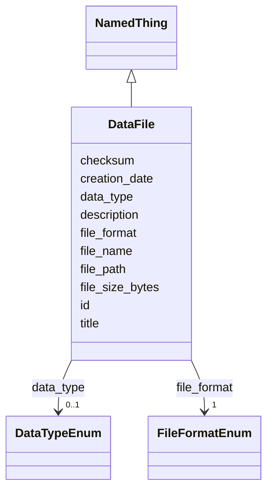

# Class: DataFile 


_A data file generated or used in the study_


URI: [biostride_schema:DataFile](https://w3id.org/biostride/schema/DataFile)





## Inheritance
* [NamedThing](NamedThing.md)
    * **DataFile**


## Slots

| Name | Cardinality and Range | Description | Inheritance |
| ---  | --- | --- | --- |
| [file_name](file_name.md) | 1 <br/> [String](String.md) | Name of the file | direct |
| [file_path](file_path.md) | 0..1 <br/> [String](String.md) | Path to the file | direct |
| [file_format](file_format.md) | 1 <br/> [FileFormatEnum](FileFormatEnum.md) | File format | direct |
| [file_size_bytes](file_size_bytes.md) | 0..1 <br/> [Integer](Integer.md) | File size in bytes | direct |
| [checksum](checksum.md) | 0..1 <br/> [String](String.md) | SHA-256 checksum for data integrity | direct |
| [creation_date](creation_date.md) | 0..1 <br/> [String](String.md) | File creation date | direct |
| [data_type](data_type.md) | 0..1 <br/> [DataTypeEnum](DataTypeEnum.md) | Type of data in the file | direct |
| [id](id.md) | 1 <br/> [Uriorcurie](Uriorcurie.md) |  | [NamedThing](NamedThing.md) |
| [title](title.md) | 0..1 <br/> [String](String.md) |  | [NamedThing](NamedThing.md) |
| [description](description.md) | 0..1 <br/> [String](String.md) |  | [NamedThing](NamedThing.md) |


## Usages

| used by | used in | type | used |
| ---  | --- | --- | --- |
| [Study](Study.md) | [data_files](data_files.md) | range | [DataFile](DataFile.md) |
| [WorkflowRun](WorkflowRun.md) | [output_files](output_files.md) | range | [DataFile](DataFile.md) |


## Identifier and Mapping Information


### Schema Source


* from schema: https://w3id.org/biostride/


## Mappings

| Mapping Type | Mapped Value |
| ---  | ---  |
| self | biostride_schema:DataFile |
| native | biostride_schema:DataFile |


## LinkML Source

<!-- TODO: investigate https://stackoverflow.com/questions/37606292/how-to-create-tabbed-code-blocks-in-mkdocs-or-sphinx -->

### Direct

<details>
```yaml
name: DataFile
description: A data file generated or used in the study
from_schema: https://w3id.org/biostride/
is_a: NamedThing
attributes:
  file_name:
    name: file_name
    description: Name of the file
    from_schema: https://w3id.org/biostride/
    rank: 1000
    domain_of:
    - DataFile
    - Image
    required: true
  file_path:
    name: file_path
    description: Path to the file
    from_schema: https://w3id.org/biostride/
    rank: 1000
    domain_of:
    - DataFile
  file_format:
    name: file_format
    description: File format
    from_schema: https://w3id.org/biostride/
    rank: 1000
    domain_of:
    - DataFile
    range: FileFormatEnum
    required: true
  file_size_bytes:
    name: file_size_bytes
    description: File size in bytes
    from_schema: https://w3id.org/biostride/
    rank: 1000
    domain_of:
    - DataFile
    range: integer
  checksum:
    name: checksum
    description: SHA-256 checksum for data integrity
    from_schema: https://w3id.org/biostride/
    rank: 1000
    domain_of:
    - DataFile
  creation_date:
    name: creation_date
    description: File creation date
    from_schema: https://w3id.org/biostride/
    rank: 1000
    domain_of:
    - DataFile
    range: string
  data_type:
    name: data_type
    description: Type of data in the file
    from_schema: https://w3id.org/biostride/
    rank: 1000
    domain_of:
    - DataFile
    range: DataTypeEnum

```
</details>

### Induced

<details>
```yaml
name: DataFile
description: A data file generated or used in the study
from_schema: https://w3id.org/biostride/
is_a: NamedThing
attributes:
  file_name:
    name: file_name
    description: Name of the file
    from_schema: https://w3id.org/biostride/
    rank: 1000
    alias: file_name
    owner: DataFile
    domain_of:
    - DataFile
    - Image
    range: string
    required: true
  file_path:
    name: file_path
    description: Path to the file
    from_schema: https://w3id.org/biostride/
    rank: 1000
    alias: file_path
    owner: DataFile
    domain_of:
    - DataFile
    range: string
  file_format:
    name: file_format
    description: File format
    from_schema: https://w3id.org/biostride/
    rank: 1000
    alias: file_format
    owner: DataFile
    domain_of:
    - DataFile
    range: FileFormatEnum
    required: true
  file_size_bytes:
    name: file_size_bytes
    description: File size in bytes
    from_schema: https://w3id.org/biostride/
    rank: 1000
    alias: file_size_bytes
    owner: DataFile
    domain_of:
    - DataFile
    range: integer
  checksum:
    name: checksum
    description: SHA-256 checksum for data integrity
    from_schema: https://w3id.org/biostride/
    rank: 1000
    alias: checksum
    owner: DataFile
    domain_of:
    - DataFile
    range: string
  creation_date:
    name: creation_date
    description: File creation date
    from_schema: https://w3id.org/biostride/
    rank: 1000
    alias: creation_date
    owner: DataFile
    domain_of:
    - DataFile
    range: string
  data_type:
    name: data_type
    description: Type of data in the file
    from_schema: https://w3id.org/biostride/
    rank: 1000
    alias: data_type
    owner: DataFile
    domain_of:
    - DataFile
    range: DataTypeEnum
  id:
    name: id
    from_schema: https://w3id.org/biostride/
    rank: 1000
    identifier: true
    alias: id
    owner: DataFile
    domain_of:
    - NamedThing
    - OntologyTerm
    range: uriorcurie
    required: true
  title:
    name: title
    from_schema: https://w3id.org/biostride/
    rank: 1000
    slot_uri: dcterms:title
    alias: title
    owner: DataFile
    domain_of:
    - NamedThing
    range: string
  description:
    name: description
    from_schema: https://w3id.org/biostride/
    rank: 1000
    alias: description
    owner: DataFile
    domain_of:
    - NamedThing
    range: string

```
</details>