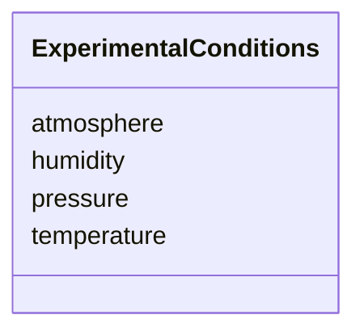

# Class: ExperimentalConditions 


_Environmental and experimental conditions_


URI: [biostride_schema:ExperimentalConditions](https://w3id.org/biostride/schema/ExperimentalConditions)





<!-- no inheritance hierarchy -->


## Slots

| Name | Cardinality and Range | Description | Inheritance |
| ---  | --- | --- | --- |
| [temperature](temperature.md) | 0..1 <br/> [Float](Float.md) | Temperature in Celsius | direct |
| [humidity](humidity.md) | 0..1 <br/> [Float](Float.md) | Humidity percentage | direct |
| [pressure](pressure.md) | 0..1 <br/> [Float](Float.md) | Pressure in kPa | direct |
| [atmosphere](atmosphere.md) | 0..1 <br/> [String](String.md) | Atmosphere composition | direct |


## Usages

| used by | used in | type | used |
| ---  | --- | --- | --- |
| [ExperimentRun](ExperimentRun.md) | [experimental_conditions](experimental_conditions.md) | range | [ExperimentalConditions](ExperimentalConditions.md) |


## Identifier and Mapping Information


### Schema Source


* from schema: https://w3id.org/biostride/


## Mappings

| Mapping Type | Mapped Value |
| ---  | ---  |
| self | biostride_schema:ExperimentalConditions |
| native | biostride_schema:ExperimentalConditions |


## LinkML Source

<!-- TODO: investigate https://stackoverflow.com/questions/37606292/how-to-create-tabbed-code-blocks-in-mkdocs-or-sphinx -->

### Direct

<details>
```yaml
name: ExperimentalConditions
description: Environmental and experimental conditions
from_schema: https://w3id.org/biostride/
attributes:
  temperature:
    name: temperature
    description: Temperature in Celsius
    from_schema: https://w3id.org/biostride/
    domain_of:
    - StorageConditions
    - ExperimentalConditions
    range: float
  humidity:
    name: humidity
    description: Humidity percentage
    from_schema: https://w3id.org/biostride/
    rank: 1000
    domain_of:
    - ExperimentalConditions
    range: float
  pressure:
    name: pressure
    description: Pressure in kPa
    from_schema: https://w3id.org/biostride/
    rank: 1000
    domain_of:
    - ExperimentalConditions
    range: float
  atmosphere:
    name: atmosphere
    description: Atmosphere composition
    from_schema: https://w3id.org/biostride/
    domain_of:
    - StorageConditions
    - ExperimentalConditions

```
</details>

### Induced

<details>
```yaml
name: ExperimentalConditions
description: Environmental and experimental conditions
from_schema: https://w3id.org/biostride/
attributes:
  temperature:
    name: temperature
    description: Temperature in Celsius
    from_schema: https://w3id.org/biostride/
    alias: temperature
    owner: ExperimentalConditions
    domain_of:
    - StorageConditions
    - ExperimentalConditions
    range: float
  humidity:
    name: humidity
    description: Humidity percentage
    from_schema: https://w3id.org/biostride/
    rank: 1000
    alias: humidity
    owner: ExperimentalConditions
    domain_of:
    - ExperimentalConditions
    range: float
  pressure:
    name: pressure
    description: Pressure in kPa
    from_schema: https://w3id.org/biostride/
    rank: 1000
    alias: pressure
    owner: ExperimentalConditions
    domain_of:
    - ExperimentalConditions
    range: float
  atmosphere:
    name: atmosphere
    description: Atmosphere composition
    from_schema: https://w3id.org/biostride/
    alias: atmosphere
    owner: ExperimentalConditions
    domain_of:
    - StorageConditions
    - ExperimentalConditions
    range: string

```
</details>