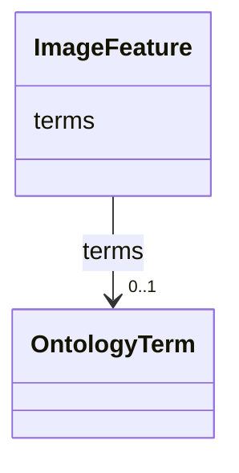

# Class: ImageFeature 


URI: [biostride_schema:ImageFeature](https://w3id.org/biostride/schema/ImageFeature)





<!-- no inheritance hierarchy -->


## Slots

| Name | Cardinality and Range | Description | Inheritance |
| ---  | --- | --- | --- |
| [terms](terms.md) | 0..1 <br/> [OntologyTerm](OntologyTerm.md) |  | direct |


## Identifier and Mapping Information


### Schema Source


* from schema: https://w3id.org/biostride/


## Mappings

| Mapping Type | Mapped Value |
| ---  | ---  |
| self | biostride_schema:ImageFeature |
| native | biostride_schema:ImageFeature |


## LinkML Source

<!-- TODO: investigate https://stackoverflow.com/questions/37606292/how-to-create-tabbed-code-blocks-in-mkdocs-or-sphinx -->

### Direct

<details>
```yaml
name: ImageFeature
from_schema: https://w3id.org/biostride/
attributes:
  terms:
    name: terms
    from_schema: https://w3id.org/biostride/
    rank: 1000
    domain_of:
    - ImageFeature
    range: OntologyTerm

```
</details>

### Induced

<details>
```yaml
name: ImageFeature
from_schema: https://w3id.org/biostride/
attributes:
  terms:
    name: terms
    from_schema: https://w3id.org/biostride/
    rank: 1000
    alias: terms
    owner: ImageFeature
    domain_of:
    - ImageFeature
    range: OntologyTerm

```
</details>