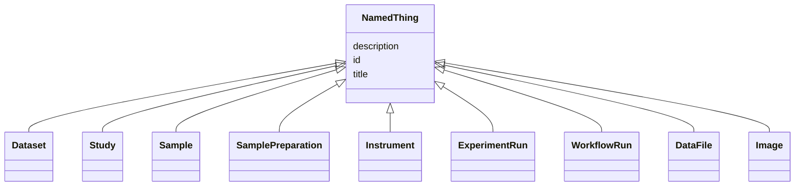

# Class: NamedThing 


_A named thing_


* __NOTE__: this is an abstract class and should not be instantiated directly


URI: [biostride_schema:NamedThing](https://w3id.org/biostride/schema/NamedThing)





## Inheritance
* **NamedThing**
    * [Dataset](Dataset.md)
    * [Study](Study.md)
    * [Sample](Sample.md)
    * [SamplePreparation](SamplePreparation.md)
    * [Instrument](Instrument.md)
    * [ExperimentRun](ExperimentRun.md)
    * [WorkflowRun](WorkflowRun.md)
    * [DataFile](DataFile.md)
    * [Image](Image.md)


## Slots

| Name | Cardinality and Range | Description | Inheritance |
| ---  | --- | --- | --- |
| [id](id.md) | 1 <br/> [Uriorcurie](Uriorcurie.md) |  | direct |
| [title](title.md) | 0..1 <br/> [String](String.md) |  | direct |
| [description](description.md) | 0..1 <br/> [String](String.md) |  | direct |


## Identifier and Mapping Information


### Schema Source


* from schema: https://w3id.org/biostride/


## Mappings

| Mapping Type | Mapped Value |
| ---  | ---  |
| self | biostride_schema:NamedThing |
| native | biostride_schema:NamedThing |


## LinkML Source

<!-- TODO: investigate https://stackoverflow.com/questions/37606292/how-to-create-tabbed-code-blocks-in-mkdocs-or-sphinx -->

### Direct

<details>
```yaml
name: NamedThing
description: A named thing
from_schema: https://w3id.org/biostride/
abstract: true
attributes:
  id:
    name: id
    from_schema: https://w3id.org/biostride/
    rank: 1000
    identifier: true
    domain_of:
    - NamedThing
    - OntologyTerm
    range: uriorcurie
    required: true
  title:
    name: title
    from_schema: https://w3id.org/biostride/
    rank: 1000
    slot_uri: dcterms:title
    domain_of:
    - NamedThing
  description:
    name: description
    from_schema: https://w3id.org/biostride/
    rank: 1000
    domain_of:
    - NamedThing
    range: string

```
</details>

### Induced

<details>
```yaml
name: NamedThing
description: A named thing
from_schema: https://w3id.org/biostride/
abstract: true
attributes:
  id:
    name: id
    from_schema: https://w3id.org/biostride/
    rank: 1000
    identifier: true
    alias: id
    owner: NamedThing
    domain_of:
    - NamedThing
    - OntologyTerm
    range: uriorcurie
  title:
    name: title
    from_schema: https://w3id.org/biostride/
    rank: 1000
    slot_uri: dcterms:title
    alias: title
    owner: NamedThing
    domain_of:
    - NamedThing
    range: string
  description:
    name: description
    from_schema: https://w3id.org/biostride/
    rank: 1000
    alias: description
    owner: NamedThing
    domain_of:
    - NamedThing
    range: string

```
</details>