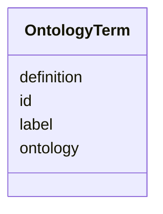

# Class: OntologyTerm 


URI: [biostride_schema:OntologyTerm](https://w3id.org/biostride/schema/OntologyTerm)





<!-- no inheritance hierarchy -->


## Slots

| Name | Cardinality and Range | Description | Inheritance |
| ---  | --- | --- | --- |
| [id](id.md) | 1 <br/> [String](String.md) |  | direct |
| [label](label.md) | 0..1 <br/> [String](String.md) |  | direct |
| [definition](definition.md) | 0..1 <br/> [String](String.md) |  | direct |
| [ontology](ontology.md) | 0..1 <br/> [String](String.md) |  | direct |


## Usages

| used by | used in | type | used |
| ---  | --- | --- | --- |
| [ImageFeature](ImageFeature.md) | [terms](terms.md) | range | [OntologyTerm](OntologyTerm.md) |


## Identifier and Mapping Information


### Schema Source


* from schema: https://w3id.org/biostride/


## Mappings

| Mapping Type | Mapped Value |
| ---  | ---  |
| self | biostride_schema:OntologyTerm |
| native | biostride_schema:OntologyTerm |


## LinkML Source

<!-- TODO: investigate https://stackoverflow.com/questions/37606292/how-to-create-tabbed-code-blocks-in-mkdocs-or-sphinx -->

### Direct

<details>
```yaml
name: OntologyTerm
from_schema: https://w3id.org/biostride/
attributes:
  id:
    name: id
    from_schema: https://w3id.org/biostride/
    identifier: true
    domain_of:
    - NamedThing
    - OntologyTerm
    range: string
    required: true
  label:
    name: label
    from_schema: https://w3id.org/biostride/
    rank: 1000
    domain_of:
    - OntologyTerm
    range: string
  definition:
    name: definition
    from_schema: https://w3id.org/biostride/
    rank: 1000
    domain_of:
    - OntologyTerm
    range: string
  ontology:
    name: ontology
    from_schema: https://w3id.org/biostride/
    rank: 1000
    domain_of:
    - OntologyTerm
    range: string

```
</details>

### Induced

<details>
```yaml
name: OntologyTerm
from_schema: https://w3id.org/biostride/
attributes:
  id:
    name: id
    from_schema: https://w3id.org/biostride/
    identifier: true
    alias: id
    owner: OntologyTerm
    domain_of:
    - NamedThing
    - OntologyTerm
    range: string
    required: true
  label:
    name: label
    from_schema: https://w3id.org/biostride/
    rank: 1000
    alias: label
    owner: OntologyTerm
    domain_of:
    - OntologyTerm
    range: string
  definition:
    name: definition
    from_schema: https://w3id.org/biostride/
    rank: 1000
    alias: definition
    owner: OntologyTerm
    domain_of:
    - OntologyTerm
    range: string
  ontology:
    name: ontology
    from_schema: https://w3id.org/biostride/
    rank: 1000
    alias: ontology
    owner: OntologyTerm
    domain_of:
    - OntologyTerm
    range: string

```
</details>