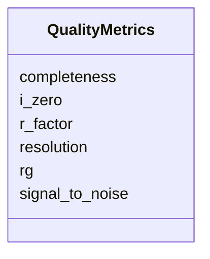

# Class: QualityMetrics 


_Quality metrics for experiments_


URI: [biostride_schema:QualityMetrics](https://w3id.org/biostride/schema/QualityMetrics)





<!-- no inheritance hierarchy -->


## Slots

| Name | Cardinality and Range | Description | Inheritance |
| ---  | --- | --- | --- |
| [resolution](resolution.md) | 0..1 <br/> [Float](Float.md) | Resolution in Angstroms | direct |
| [completeness](completeness.md) | 0..1 <br/> [Float](Float.md) | Data completeness percentage | direct |
| [signal_to_noise](signal_to_noise.md) | 0..1 <br/> [Float](Float.md) | Signal to noise ratio | direct |
| [r_factor](r_factor.md) | 0..1 <br/> [Float](Float.md) | R-factor for crystallography | direct |
| [i_zero](i_zero.md) | 0..1 <br/> [Float](Float.md) | Forward scattering intensity I(0) | direct |
| [rg](rg.md) | 0..1 <br/> [Float](Float.md) | Radius of gyration in Angstroms | direct |


## Usages

| used by | used in | type | used |
| ---  | --- | --- | --- |
| [ExperimentRun](ExperimentRun.md) | [quality_metrics](quality_metrics.md) | range | [QualityMetrics](QualityMetrics.md) |


## Identifier and Mapping Information


### Schema Source


* from schema: https://w3id.org/biostride/


## Mappings

| Mapping Type | Mapped Value |
| ---  | ---  |
| self | biostride_schema:QualityMetrics |
| native | biostride_schema:QualityMetrics |


## LinkML Source

<!-- TODO: investigate https://stackoverflow.com/questions/37606292/how-to-create-tabbed-code-blocks-in-mkdocs-or-sphinx -->

### Direct

<details>
```yaml
name: QualityMetrics
description: Quality metrics for experiments
from_schema: https://w3id.org/biostride/
attributes:
  resolution:
    name: resolution
    description: Resolution in Angstroms
    from_schema: https://w3id.org/biostride/
    rank: 1000
    domain_of:
    - QualityMetrics
    range: float
  completeness:
    name: completeness
    description: Data completeness percentage
    from_schema: https://w3id.org/biostride/
    rank: 1000
    domain_of:
    - QualityMetrics
    range: float
  signal_to_noise:
    name: signal_to_noise
    description: Signal to noise ratio
    from_schema: https://w3id.org/biostride/
    rank: 1000
    domain_of:
    - QualityMetrics
    range: float
  r_factor:
    name: r_factor
    description: R-factor for crystallography
    from_schema: https://w3id.org/biostride/
    rank: 1000
    domain_of:
    - QualityMetrics
    range: float
  i_zero:
    name: i_zero
    description: Forward scattering intensity I(0)
    from_schema: https://w3id.org/biostride/
    rank: 1000
    domain_of:
    - QualityMetrics
    range: float
  rg:
    name: rg
    description: Radius of gyration in Angstroms
    from_schema: https://w3id.org/biostride/
    rank: 1000
    domain_of:
    - QualityMetrics
    range: float

```
</details>

### Induced

<details>
```yaml
name: QualityMetrics
description: Quality metrics for experiments
from_schema: https://w3id.org/biostride/
attributes:
  resolution:
    name: resolution
    description: Resolution in Angstroms
    from_schema: https://w3id.org/biostride/
    rank: 1000
    alias: resolution
    owner: QualityMetrics
    domain_of:
    - QualityMetrics
    range: float
  completeness:
    name: completeness
    description: Data completeness percentage
    from_schema: https://w3id.org/biostride/
    rank: 1000
    alias: completeness
    owner: QualityMetrics
    domain_of:
    - QualityMetrics
    range: float
  signal_to_noise:
    name: signal_to_noise
    description: Signal to noise ratio
    from_schema: https://w3id.org/biostride/
    rank: 1000
    alias: signal_to_noise
    owner: QualityMetrics
    domain_of:
    - QualityMetrics
    range: float
  r_factor:
    name: r_factor
    description: R-factor for crystallography
    from_schema: https://w3id.org/biostride/
    rank: 1000
    alias: r_factor
    owner: QualityMetrics
    domain_of:
    - QualityMetrics
    range: float
  i_zero:
    name: i_zero
    description: Forward scattering intensity I(0)
    from_schema: https://w3id.org/biostride/
    rank: 1000
    alias: i_zero
    owner: QualityMetrics
    domain_of:
    - QualityMetrics
    range: float
  rg:
    name: rg
    description: Radius of gyration in Angstroms
    from_schema: https://w3id.org/biostride/
    rank: 1000
    alias: rg
    owner: QualityMetrics
    domain_of:
    - QualityMetrics
    range: float

```
</details>