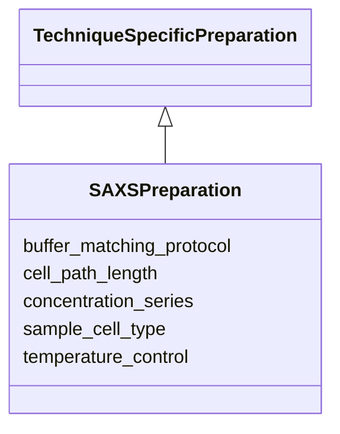

# Class: SAXSPreparation 


_SAXS/WAXS specific preparation_


URI: [biostride_schema:SAXSPreparation](https://w3id.org/biostride/schema/SAXSPreparation)





## Inheritance
* [TechniqueSpecificPreparation](TechniqueSpecificPreparation.md)
    * **SAXSPreparation**


## Slots

| Name | Cardinality and Range | Description | Inheritance |
| ---  | --- | --- | --- |
| [concentration_series](concentration_series.md) | * <br/> [Float](Float.md) | Concentration values for series measurements | direct |
| [buffer_matching_protocol](buffer_matching_protocol.md) | 0..1 <br/> [String](String.md) | Protocol for buffer matching | direct |
| [sample_cell_type](sample_cell_type.md) | 0..1 <br/> [String](String.md) | Type of sample cell used | direct |
| [cell_path_length](cell_path_length.md) | 0..1 <br/> [Float](Float.md) | Path length in mm | direct |
| [temperature_control](temperature_control.md) | 0..1 <br/> [String](String.md) | Temperature control settings | direct |


## Identifier and Mapping Information


### Schema Source


* from schema: https://w3id.org/biostride/


## Mappings

| Mapping Type | Mapped Value |
| ---  | ---  |
| self | biostride_schema:SAXSPreparation |
| native | biostride_schema:SAXSPreparation |


## LinkML Source

<!-- TODO: investigate https://stackoverflow.com/questions/37606292/how-to-create-tabbed-code-blocks-in-mkdocs-or-sphinx -->

### Direct

<details>
```yaml
name: SAXSPreparation
description: SAXS/WAXS specific preparation
from_schema: https://w3id.org/biostride/
is_a: TechniqueSpecificPreparation
attributes:
  concentration_series:
    name: concentration_series
    description: Concentration values for series measurements
    from_schema: https://w3id.org/biostride/
    rank: 1000
    domain_of:
    - SAXSPreparation
    range: float
    multivalued: true
  buffer_matching_protocol:
    name: buffer_matching_protocol
    description: Protocol for buffer matching
    from_schema: https://w3id.org/biostride/
    rank: 1000
    domain_of:
    - SAXSPreparation
  sample_cell_type:
    name: sample_cell_type
    description: Type of sample cell used
    from_schema: https://w3id.org/biostride/
    rank: 1000
    domain_of:
    - SAXSPreparation
  cell_path_length:
    name: cell_path_length
    description: Path length in mm
    from_schema: https://w3id.org/biostride/
    rank: 1000
    domain_of:
    - SAXSPreparation
    range: float
  temperature_control:
    name: temperature_control
    description: Temperature control settings
    from_schema: https://w3id.org/biostride/
    rank: 1000
    domain_of:
    - SAXSPreparation

```
</details>

### Induced

<details>
```yaml
name: SAXSPreparation
description: SAXS/WAXS specific preparation
from_schema: https://w3id.org/biostride/
is_a: TechniqueSpecificPreparation
attributes:
  concentration_series:
    name: concentration_series
    description: Concentration values for series measurements
    from_schema: https://w3id.org/biostride/
    rank: 1000
    alias: concentration_series
    owner: SAXSPreparation
    domain_of:
    - SAXSPreparation
    range: float
    multivalued: true
  buffer_matching_protocol:
    name: buffer_matching_protocol
    description: Protocol for buffer matching
    from_schema: https://w3id.org/biostride/
    rank: 1000
    alias: buffer_matching_protocol
    owner: SAXSPreparation
    domain_of:
    - SAXSPreparation
    range: string
  sample_cell_type:
    name: sample_cell_type
    description: Type of sample cell used
    from_schema: https://w3id.org/biostride/
    rank: 1000
    alias: sample_cell_type
    owner: SAXSPreparation
    domain_of:
    - SAXSPreparation
    range: string
  cell_path_length:
    name: cell_path_length
    description: Path length in mm
    from_schema: https://w3id.org/biostride/
    rank: 1000
    alias: cell_path_length
    owner: SAXSPreparation
    domain_of:
    - SAXSPreparation
    range: float
  temperature_control:
    name: temperature_control
    description: Temperature control settings
    from_schema: https://w3id.org/biostride/
    rank: 1000
    alias: temperature_control
    owner: SAXSPreparation
    domain_of:
    - SAXSPreparation
    range: string

```
</details>