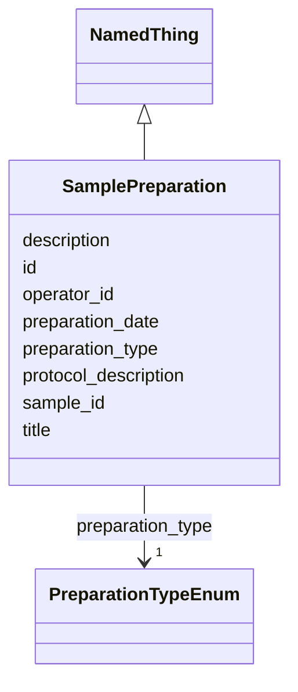

# Class: SamplePreparation 


_A process that prepares a sample for imaging_


URI: [biostride_schema:SamplePreparation](https://w3id.org/biostride/schema/SamplePreparation)





## Inheritance
* [NamedThing](NamedThing.md)
    * **SamplePreparation**


## Slots

| Name | Cardinality and Range | Description | Inheritance |
| ---  | --- | --- | --- |
| [preparation_type](preparation_type.md) | 1 <br/> [PreparationTypeEnum](PreparationTypeEnum.md) | Type of sample preparation | direct |
| [sample_id](sample_id.md) | 1 <br/> [String](String.md) | Reference to the sample being prepared | direct |
| [preparation_date](preparation_date.md) | 0..1 <br/> [String](String.md) | Date of sample preparation | direct |
| [operator_id](operator_id.md) | 0..1 <br/> [String](String.md) | Person who performed the preparation | direct |
| [protocol_description](protocol_description.md) | 0..1 <br/> [String](String.md) | Detailed protocol description | direct |
| [id](id.md) | 1 <br/> [Uriorcurie](Uriorcurie.md) |  | [NamedThing](NamedThing.md) |
| [title](title.md) | 0..1 <br/> [String](String.md) |  | [NamedThing](NamedThing.md) |
| [description](description.md) | 0..1 <br/> [String](String.md) |  | [NamedThing](NamedThing.md) |


## Usages

| used by | used in | type | used |
| ---  | --- | --- | --- |
| [Study](Study.md) | [sample_preparations](sample_preparations.md) | range | [SamplePreparation](SamplePreparation.md) |


## Identifier and Mapping Information


### Schema Source


* from schema: https://w3id.org/biostride/


## Mappings

| Mapping Type | Mapped Value |
| ---  | ---  |
| self | biostride_schema:SamplePreparation |
| native | biostride_schema:SamplePreparation |


## LinkML Source

<!-- TODO: investigate https://stackoverflow.com/questions/37606292/how-to-create-tabbed-code-blocks-in-mkdocs-or-sphinx -->

### Direct

<details>
```yaml
name: SamplePreparation
description: A process that prepares a sample for imaging
from_schema: https://w3id.org/biostride/
is_a: NamedThing
attributes:
  preparation_type:
    name: preparation_type
    description: Type of sample preparation
    from_schema: https://w3id.org/biostride/
    rank: 1000
    domain_of:
    - SamplePreparation
    range: PreparationTypeEnum
    required: true
  sample_id:
    name: sample_id
    description: Reference to the sample being prepared
    from_schema: https://w3id.org/biostride/
    rank: 1000
    domain_of:
    - SamplePreparation
    - ExperimentRun
    range: string
    required: true
  preparation_date:
    name: preparation_date
    description: Date of sample preparation
    from_schema: https://w3id.org/biostride/
    rank: 1000
    domain_of:
    - SamplePreparation
    range: string
  operator_id:
    name: operator_id
    description: Person who performed the preparation
    from_schema: https://w3id.org/biostride/
    rank: 1000
    domain_of:
    - SamplePreparation
    - ExperimentRun
    range: string
  protocol_description:
    name: protocol_description
    description: Detailed protocol description
    from_schema: https://w3id.org/biostride/
    rank: 1000
    domain_of:
    - SamplePreparation

```
</details>

### Induced

<details>
```yaml
name: SamplePreparation
description: A process that prepares a sample for imaging
from_schema: https://w3id.org/biostride/
is_a: NamedThing
attributes:
  preparation_type:
    name: preparation_type
    description: Type of sample preparation
    from_schema: https://w3id.org/biostride/
    rank: 1000
    alias: preparation_type
    owner: SamplePreparation
    domain_of:
    - SamplePreparation
    range: PreparationTypeEnum
    required: true
  sample_id:
    name: sample_id
    description: Reference to the sample being prepared
    from_schema: https://w3id.org/biostride/
    rank: 1000
    alias: sample_id
    owner: SamplePreparation
    domain_of:
    - SamplePreparation
    - ExperimentRun
    range: string
    required: true
  preparation_date:
    name: preparation_date
    description: Date of sample preparation
    from_schema: https://w3id.org/biostride/
    rank: 1000
    alias: preparation_date
    owner: SamplePreparation
    domain_of:
    - SamplePreparation
    range: string
  operator_id:
    name: operator_id
    description: Person who performed the preparation
    from_schema: https://w3id.org/biostride/
    rank: 1000
    alias: operator_id
    owner: SamplePreparation
    domain_of:
    - SamplePreparation
    - ExperimentRun
    range: string
  protocol_description:
    name: protocol_description
    description: Detailed protocol description
    from_schema: https://w3id.org/biostride/
    rank: 1000
    alias: protocol_description
    owner: SamplePreparation
    domain_of:
    - SamplePreparation
    range: string
  id:
    name: id
    from_schema: https://w3id.org/biostride/
    rank: 1000
    identifier: true
    alias: id
    owner: SamplePreparation
    domain_of:
    - NamedThing
    - OntologyTerm
    range: uriorcurie
    required: true
  title:
    name: title
    from_schema: https://w3id.org/biostride/
    rank: 1000
    slot_uri: dcterms:title
    alias: title
    owner: SamplePreparation
    domain_of:
    - NamedThing
    range: string
  description:
    name: description
    from_schema: https://w3id.org/biostride/
    rank: 1000
    alias: description
    owner: SamplePreparation
    domain_of:
    - NamedThing
    range: string

```
</details>