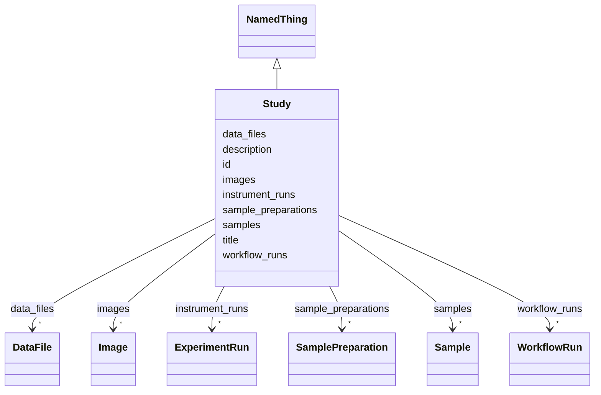

# Class: Study 


URI: [biostride_schema:Study](https://w3id.org/biostride/schema/Study)





## Inheritance
* [NamedThing](NamedThing.md)
    * **Study**


## Slots

| Name | Cardinality and Range | Description | Inheritance |
| ---  | --- | --- | --- |
| [samples](samples.md) | * <br/> [Sample](Sample.md) |  | direct |
| [sample_preparations](sample_preparations.md) | * <br/> [SamplePreparation](SamplePreparation.md) |  | direct |
| [instrument_runs](instrument_runs.md) | * <br/> [ExperimentRun](ExperimentRun.md) |  | direct |
| [workflow_runs](workflow_runs.md) | * <br/> [WorkflowRun](WorkflowRun.md) |  | direct |
| [data_files](data_files.md) | * <br/> [DataFile](DataFile.md) |  | direct |
| [images](images.md) | * <br/> [Image](Image.md) |  | direct |
| [id](id.md) | 1 <br/> [Uriorcurie](Uriorcurie.md) |  | [NamedThing](NamedThing.md) |
| [title](title.md) | 0..1 <br/> [String](String.md) |  | [NamedThing](NamedThing.md) |
| [description](description.md) | 0..1 <br/> [String](String.md) |  | [NamedThing](NamedThing.md) |


## Usages

| used by | used in | type | used |
| ---  | --- | --- | --- |
| [Dataset](Dataset.md) | [studies](studies.md) | range | [Study](Study.md) |


## Identifier and Mapping Information


### Schema Source


* from schema: https://w3id.org/biostride/


## Mappings

| Mapping Type | Mapped Value |
| ---  | ---  |
| self | biostride_schema:Study |
| native | biostride_schema:Study |


## LinkML Source

<!-- TODO: investigate https://stackoverflow.com/questions/37606292/how-to-create-tabbed-code-blocks-in-mkdocs-or-sphinx -->

### Direct

<details>
```yaml
name: Study
from_schema: https://w3id.org/biostride/
is_a: NamedThing
attributes:
  samples:
    name: samples
    from_schema: https://w3id.org/biostride/
    rank: 1000
    domain_of:
    - Study
    range: Sample
    multivalued: true
    inlined: true
    inlined_as_list: true
  sample_preparations:
    name: sample_preparations
    from_schema: https://w3id.org/biostride/
    rank: 1000
    domain_of:
    - Study
    range: SamplePreparation
    multivalued: true
    inlined: true
    inlined_as_list: true
  instrument_runs:
    name: instrument_runs
    from_schema: https://w3id.org/biostride/
    rank: 1000
    domain_of:
    - Study
    range: ExperimentRun
    multivalued: true
    inlined: true
    inlined_as_list: true
  workflow_runs:
    name: workflow_runs
    from_schema: https://w3id.org/biostride/
    rank: 1000
    domain_of:
    - Study
    range: WorkflowRun
    multivalued: true
    inlined: true
    inlined_as_list: true
  data_files:
    name: data_files
    from_schema: https://w3id.org/biostride/
    rank: 1000
    domain_of:
    - Study
    range: DataFile
    multivalued: true
    inlined: true
    inlined_as_list: true
  images:
    name: images
    from_schema: https://w3id.org/biostride/
    rank: 1000
    domain_of:
    - Study
    range: Image
    multivalued: true
    inlined: true
    inlined_as_list: true

```
</details>

### Induced

<details>
```yaml
name: Study
from_schema: https://w3id.org/biostride/
is_a: NamedThing
attributes:
  samples:
    name: samples
    from_schema: https://w3id.org/biostride/
    rank: 1000
    alias: samples
    owner: Study
    domain_of:
    - Study
    range: Sample
    multivalued: true
    inlined: true
    inlined_as_list: true
  sample_preparations:
    name: sample_preparations
    from_schema: https://w3id.org/biostride/
    rank: 1000
    alias: sample_preparations
    owner: Study
    domain_of:
    - Study
    range: SamplePreparation
    multivalued: true
    inlined: true
    inlined_as_list: true
  instrument_runs:
    name: instrument_runs
    from_schema: https://w3id.org/biostride/
    rank: 1000
    alias: instrument_runs
    owner: Study
    domain_of:
    - Study
    range: ExperimentRun
    multivalued: true
    inlined: true
    inlined_as_list: true
  workflow_runs:
    name: workflow_runs
    from_schema: https://w3id.org/biostride/
    rank: 1000
    alias: workflow_runs
    owner: Study
    domain_of:
    - Study
    range: WorkflowRun
    multivalued: true
    inlined: true
    inlined_as_list: true
  data_files:
    name: data_files
    from_schema: https://w3id.org/biostride/
    rank: 1000
    alias: data_files
    owner: Study
    domain_of:
    - Study
    range: DataFile
    multivalued: true
    inlined: true
    inlined_as_list: true
  images:
    name: images
    from_schema: https://w3id.org/biostride/
    rank: 1000
    alias: images
    owner: Study
    domain_of:
    - Study
    range: Image
    multivalued: true
    inlined: true
    inlined_as_list: true
  id:
    name: id
    from_schema: https://w3id.org/biostride/
    rank: 1000
    identifier: true
    alias: id
    owner: Study
    domain_of:
    - NamedThing
    - OntologyTerm
    range: uriorcurie
    required: true
  title:
    name: title
    from_schema: https://w3id.org/biostride/
    rank: 1000
    slot_uri: dcterms:title
    alias: title
    owner: Study
    domain_of:
    - NamedThing
    range: string
  description:
    name: description
    from_schema: https://w3id.org/biostride/
    rank: 1000
    alias: description
    owner: Study
    domain_of:
    - NamedThing
    range: string

```
</details>