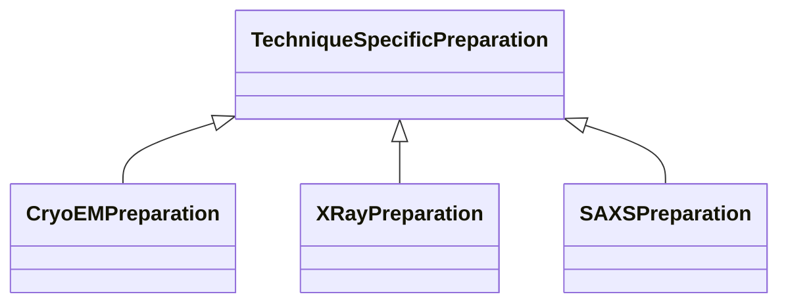

# Class: TechniqueSpecificPreparation 


_Base class for technique-specific preparation details_


* __NOTE__: this is an abstract class and should not be instantiated directly


URI: [biostride_schema:TechniqueSpecificPreparation](https://w3id.org/biostride/schema/TechniqueSpecificPreparation)





## Inheritance
* **TechniqueSpecificPreparation**
    * [CryoEMPreparation](CryoEMPreparation.md)
    * [XRayPreparation](XRayPreparation.md)
    * [SAXSPreparation](SAXSPreparation.md)


## Slots

| Name | Cardinality and Range | Description | Inheritance |
| ---  | --- | --- | --- |


## Identifier and Mapping Information


### Schema Source


* from schema: https://w3id.org/biostride/


## Mappings

| Mapping Type | Mapped Value |
| ---  | ---  |
| self | biostride_schema:TechniqueSpecificPreparation |
| native | biostride_schema:TechniqueSpecificPreparation |


## LinkML Source

<!-- TODO: investigate https://stackoverflow.com/questions/37606292/how-to-create-tabbed-code-blocks-in-mkdocs-or-sphinx -->

### Direct

<details>
```yaml
name: TechniqueSpecificPreparation
description: Base class for technique-specific preparation details
from_schema: https://w3id.org/biostride/
abstract: true

```
</details>

### Induced

<details>
```yaml
name: TechniqueSpecificPreparation
description: Base class for technique-specific preparation details
from_schema: https://w3id.org/biostride/
abstract: true

```
</details>